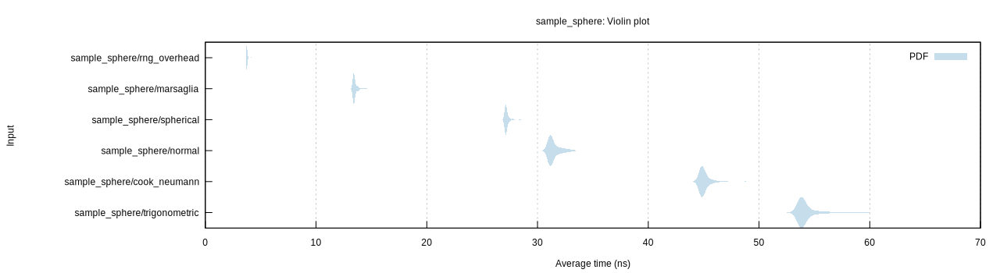

# sample-sphere

A collection of algorithms to sample from the unit sphere in 3 dimensions,
implemented in Rust.

## Usage

Use `cargo bench` to run the benchmarks. This will create a
plot similar to the following:

